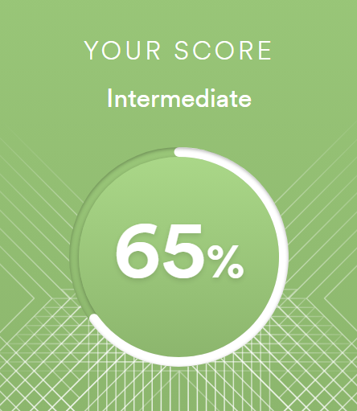

# **Vladislav Stukov**

## **Contacts**
- **E-mail:** yorokay05110@mail.ru
- **Discord** @yorokay
- **Git-hub** @Yorokay

## **About me**
At the moment my goal is to successfully complete the course from RS School, and become a confident JS/FE developer.
My main strengths are: confidence, determination, high level of social interaction, positivity.
I don't have any special work experience, but I have created several training projects for myself.
I have a very great desire and motivation to learn and pass RS School course 101%.

## **Skills**
- **HTML**
- **CSS**
- **JS**
- **Git and GitHub**
- **Figma**
- **BEM**

## **Code Example**
Spin Around, Touch the Ground from [сodewars.com](https://www.codewars.com/kata/65127141a5de2b1dcb40927e) - Given a list of directions to spin, "left" or "right", return an integer of how many full 360° rotations were made. Note that each word in the array counts as a 90° rotation in that direction.
```
function spinAround(turns) {
  let result = 0;
  for (let i = 0; i < turns.length; i++) {
    if (turns[i] === 'right') {
      result += 90;
    } else {
      result -= 90;
    }
  }
  return Math.floor(Math.abs(result) / 360);
}
```
## **Experience**
I've created a few learning projects for myself, one of them is a [yacht-club](https://yorokay.github.io/yacht-club/) I created while taking a course at *HTML Academy*

## **Education**
- **University:** Murmansk State Technical University 
- **Courses:** 
	- [learnjavascript](https://learn.javascript.ru/)
	- [w3schools](https://www.w3schools.com/)
	- [HTML Academy](https://www.htmlacademy.ru)

## **English**
My level of English is Intermediate (B1) - confirmed in an online test [](www.efset.org)

I had English practice when traveling abroad, usually communicating on everyday and casual general topics